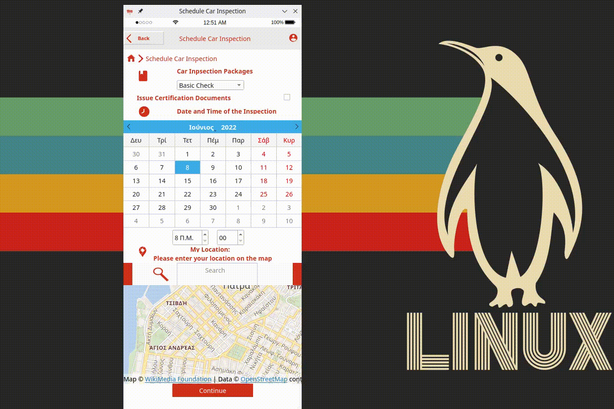

# Εγκατάσταση απαιτούμενων Python πακέτων 

Για την εκτέλεση του Project, συνίσταται η χρήστη ενός `Python virtual environment`. Θα πρέπει να έχετε `python3`, `pip` και `virtualenv3`. Στην συνέχεια, εκτελέστε τις παρακάτω εντολές :

```bash
git clone https://github.com/st1069364/CarBazaar.git #clone repo
cd CarBazaar/src
python3 -m venv venv #create a Python virtual environment inside the src directory
source venv/bin/activate # source the virtenv activation script
pip3 install -r requirements.txt #install the required packages through the requirements.txt
```

# Περιγραφή δομής αρχείων

## Φάκελος src

Στο αρχείο *classes.py* περιέχεται ο κώδικας των κλάσεων του Class Diagram του Project.

Στο αρχείο *post_car_listing.py* υπάρχει ο driver κώδικας για το demo του use case "Ανάρτηση Αγγελίας Πώλησης Οχήματος" (βλ. ui/post_car_listing.gif).

Στο αρχείο *schedule_car_inspection.py* υπάρχει ο driver κώδικας για το demo του use case "Προγραμματισμός Ελέγχου Οχήματος" (βλ. ui/schedule_car_inspection.gif).

Στον φάκελο **ui** βρίσκεται ο κώδικας του GUI.

## Φάκελος ui

To αρχείο *app_res_rc.py* αποτελεί compiled έκδοση του *qt_ui/app_res.qrc* resource file.

Στον φάκελο *qml*, βρίσκονται το QML αρχείο, που χρειάζεται για το Map Widget (χρησιμοποιείται το OpenStreetMaps plugin).

Στους φακέλους *test_docs* και *test_img* υπάρχουν αντίστοιχα, ένα δοκιμαστικό αρχείο πιστοποίησης κατάστασης οχήματος και εικόνες ενός οχήματος. Τα αρχεία αυτά χρησιμοποιούνται στο driver κώδικα για το demo του use case "Ανάρτηση Αγγελίας Πώλησης Οχήματος".

Στον φάκελο *qt_ui*, βρίσκονται τα .ui αρχεία που προκύπτουν από τον Qt Designer, και μέσω αυτών προκύπτουν οι υλοποιημένες με Python κώδικα, οθόνες.
Επίσης, στον φάκελο αυτό υπάρχει το .qrc αρχείο, που χρησιμοποιείται ως Qt Resource αρχείο, για την ομαδοποίηση όλων των resources.

Στον φάκελο *qt_ui/resources*, βρίσκονται τα απαραίτητα resources.

# Demo

## Ανάρτηση Αγγελίας Πώλησης Οχήματος
Στο αρχείο *post_car_listing.py* υπάρχει ο driver κώδικας, για το demo του use case "Ανάρτηση Αγγελίας Πώλησης Οχήματος". Στο παρακάτω gif, μπορούμε να δούμε την εκτέλεση του αρχείου .


## Προγραμματισμός Ελέγχου Οχήματος
Στο αρχείο *schedule_car_inspection.py* υπάρχει ο driver κώδικας, για το demo του use case "Προγραμματισμός Ελέγχου Οχήματος". Στο παρακάτω gif, μπορούμε αρχικά να δούμε την εκτέλεση της Βασικής Ροής, και στην συνέχεια την εκτέλεση της Βασικής Ροής και της Εναλλακτικής Ροής #2, όπου ο χρήστης επιλέγει να απορρίψει τον προτεινόμενο Ελεγκτή, και να επιλέξει τον Ελεγκτή της αρεσκείας του, εισάγοντας τα στοιχεία επικοινωνίας του.

